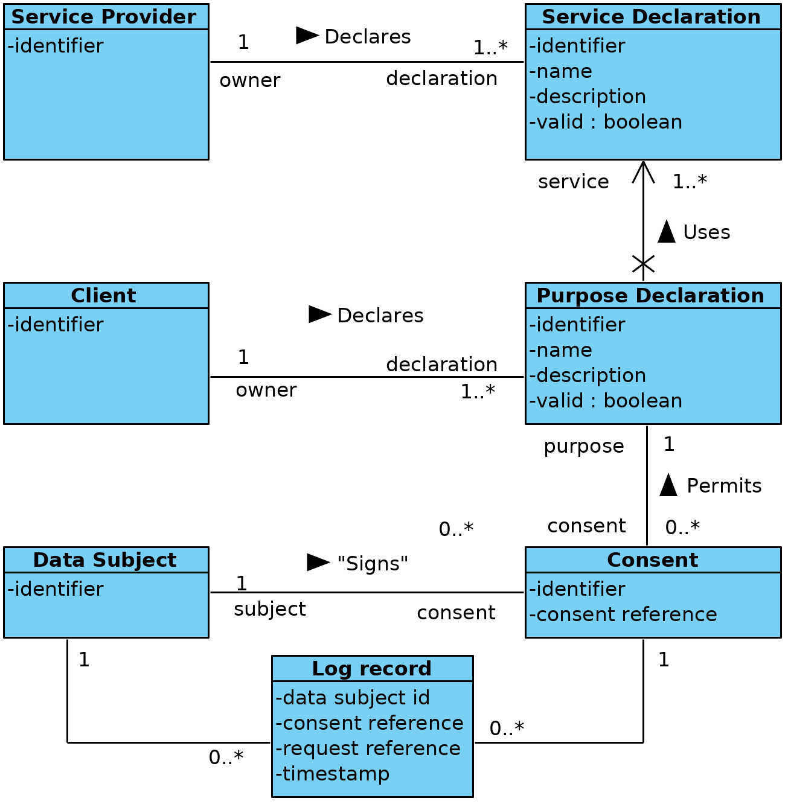
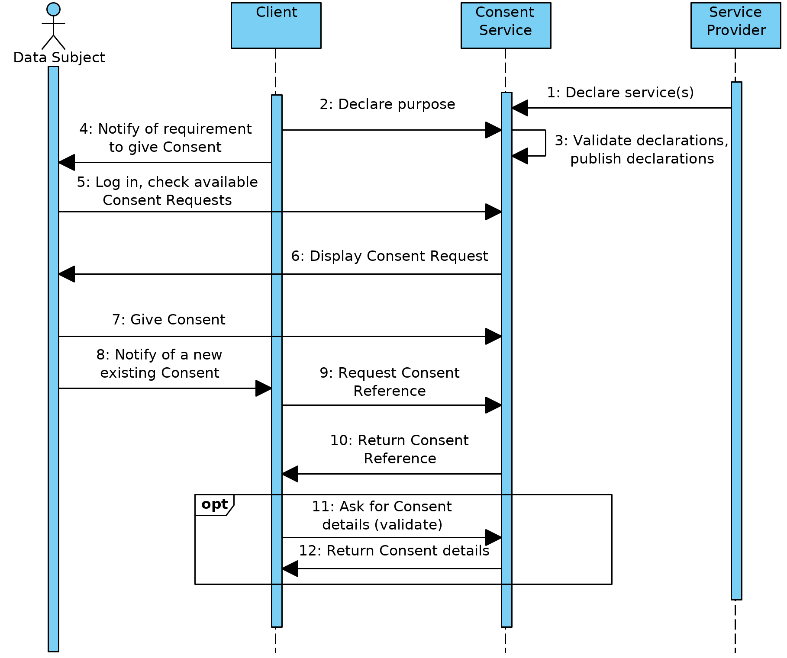
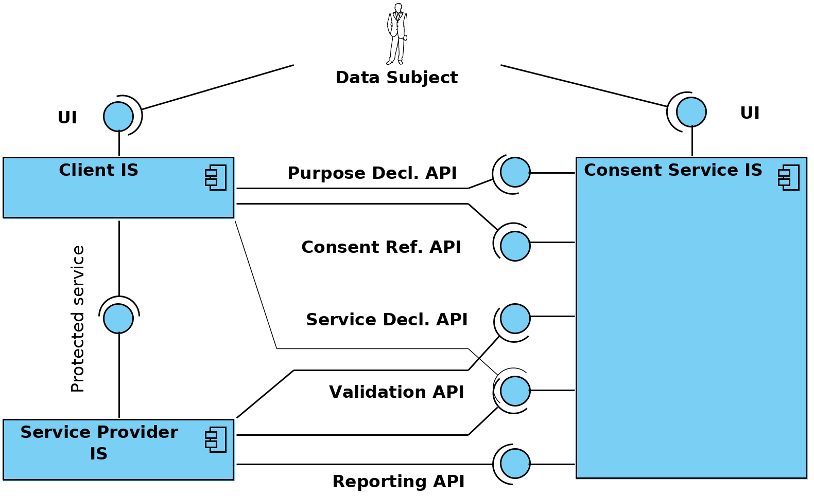

# Consent Service

**Architecture specification**

Version: 1.1

2019-12-16

Y-1341-1

---

| Date       | Ver | Description
| ---------- | --- | -----------
| 2019-12-09 | 1.0 | Initial public version
| 2019-12-16 | 1.1 | Minimally edited, converted to markdown.

<!-- markdownlint-disable MD033 -->

**Contents**

<!-- TOC -->

- [1. Introduction](#1-introduction)
  - [1.1. Purpose](#11-purpose)
  - [1.2. Background](#12-background)
  - [1.3. Terms and Abbreviations](#13-terms-and-abbreviations)
  - [1.4. References](#14-references)
- [2. Context of the Consent Service](#2-context-of-the-consent-service)
  - [2.1. Problem](#21-problem)
  - [2.2. Stakeholders](#22-stakeholders)
    - [2.2.1. Data Subject](#221-data-subject)
    - [2.2.2. Service Provider](#222-service-provider)
    - [2.2.3. Client](#223-client)
    - [2.2.4. Consent Service Provider](#224-consent-service-provider)
  - [2.3. Other considerations](#23-other-considerations)
    - [2.3.1. X-Road](#231-x-road)
    - [2.3.2. Performance](#232-performance)
    - [2.3.3. Privacy](#233-privacy)
    - [2.3.4. Development complexity](#234-development-complexity)
- [3. Model](#3-model)
  - [3.1. Data Subject](#31-data-subject)
  - [3.2. Service Provider](#32-service-provider)
  - [3.3. Client](#33-client)
  - [3.4. Service Declaration](#34-service-declaration)
  - [3.5. Purpose Declaration](#35-purpose-declaration)
  - [3.6. Consent](#36-consent)
  - [3.7. Consent Reference](#37-consent-reference)
  - [3.8. Request Reference](#38-request-reference)
  - [3.9. Validation response](#39-validation-response)
- [4. Assumed Agreements](#4-assumed-agreements)
  - [4.1. Consent Service and Parties](#41-consent-service-and-parties)
  - [4.2. Client and Service Provider](#42-client-and-service-provider)
- [5. Main process](#5-main-process)
  - [5.1. Initial conditions](#51-initial-conditions)
  - [5.2. Setup steps](#52-setup-steps)
  - [5.3. Normal usage](#53-normal-usage)
- [6. Components of the System](#6-components-of-the-system)
  - [6.1. Consent Service](#61-consent-service)
    - [6.1.1. UI for the Data Subject](#611-ui-for-the-data-subject)
    - [6.1.2. Service Declaration API](#612-service-declaration-api)
    - [6.1.3. Purpose Declaration API](#613-purpose-declaration-api)
    - [6.1.4. Consent Reference API](#614-consent-reference-api)
    - [6.1.5. Validation API](#615-validation-api)
    - [6.1.6. Reporting API](#616-reporting-api)
  - [6.2. Service Provider IS](#62-service-provider-is)
    - [6.2.1. Protected Service](#621-protected-service)
  - [6.3. Client IS](#63-client-is)
    - [6.3.1. UI](#631-ui)
  - [6.4. Consent Service Proxy](#64-consent-service-proxy)
- [7. Architectural Decisions](#7-architectural-decisions)
  - [7.1. The Protected Service is Abstract](#71-the-protected-service-is-abstract)
  - [7.2. The Parties of the Consent are Legal Entities](#72-the-parties-of-the-consent-are-legal-entities)
  - [7.3. Consent Management is Contained](#73-consent-management-is-contained)
  - [7.4. Consent Reference](#74-consent-reference)
- [8. Protocols](#8-protocols)
  - [8.1. Generic considerations](#81-generic-considerations)
    - [8.1.1. Transport](#811-transport)
    - [8.1.2. Data types](#812-data-types)
    - [8.1.3. Errors](#813-errors)
  - [8.2. Service Declaration API](#82-service-declaration-api)
    - [8.2.1. `addServiceDeclaration`](#821-addservicedeclaration)
      - [8.2.1.1. Request](#8211-request)
      - [8.2.1.2. Response](#8212-response)
      - [8.2.1.3. Errors](#8213-errors)
    - [8.2.2. `updateServiceDeclarationValidUntil`](#822-updateservicedeclarationvaliduntil)
      - [8.2.2.1. Request](#8221-request)
      - [8.2.2.2. Response](#8222-response)
      - [8.2.2.3. Errors](#8223-errors)
    - [8.2.3. `listServiceDeclarations`](#823-listservicedeclarations)
      - [8.2.3.1. Request](#8231-request)
      - [8.2.3.2. Response](#8232-response)
      - [8.2.3.3. Errors](#8233-errors)
  - [8.3. Purpose Declaration API](#83-purpose-declaration-api)
    - [8.3.1. `addPurposeDeclaration`](#831-addpurposedeclaration)
      - [8.3.1.1. Request](#8311-request)
    - [8.3.2. `updatePurposeDeclarationValidUntil`](#832-updatepurposedeclarationvaliduntil)
      - [8.3.2.1. Request](#8321-request)
    - [8.3.3. `listPurposeDeclarations`](#833-listpurposedeclarations)
      - [8.3.3.1. Request](#8331-request)
      - [8.3.3.2. Response](#8332-response)
      - [8.3.3.3. Errors](#8333-errors)
  - [8.4. Consent Reference API](#84-consent-reference-api)
    - [8.4.1. `getConsentReference`](#841-getconsentreference)
      - [8.4.1.1. Request](#8411-request)
      - [8.4.1.2. Response](#8412-response)
      - [8.4.1.3. Errors](#8413-errors)
      - [8.4.1.4. Using UI redirects](#8414-using-ui-redirects)
    - [8.4.2. `getAllConsentsFor`](#842-getallconsentsfor)
      - [8.4.2.1. Request](#8421-request)
      - [8.4.2.2. Response](#8422-response)
      - [8.4.2.3. Errors](#8423-errors)
  - [8.5. Validation API](#85-validation-api)
    - [8.5.1. `validateConsentReference`](#851-validateconsentreference)
      - [8.5.1.1. Request](#8511-request)
      - [8.5.1.2. Response](#8512-response)
  - [8.6. Reporting API](#86-reporting-api)
    - [8.6.1. `reportServiceUse`](#861-reportserviceuse)
      - [8.6.1.1. Request](#8611-request)
      - [8.6.1.2. Response](#8612-response)
  - [8.7. Protected Service](#87-protected-service)

<!-- /TOC -->

## 1. Introduction

### 1.1. Purpose

This document describes the architecture of the Consent Service. The description
consists of the problem statement, the participants and their respective
interests in the context of this system and the protocols they will use to
achieve their objectives regarding to the Consent Service.

The purpose of the document is to describe the wider context of operation and to
give input for the owners of the systems that need to integrate with the Consent
Service and to give input to the actual implementation of components of the
Consent Service.

### 1.2. Background

The document is written for the Information System Authority of the Estonian
Republic.

### 1.3. Terms and Abbreviations

- Consent Service – a service that implements a set of APIs and the protocol
  described in this document. There may be more than one Consent Service.

- Consent Service Provider – an organization that manages a Consent Service

- Protected Data – the data that the Client wants to receive from the service
  and for which it needs the Consent. Usually personally identifiable
  information (GDPR), sometimes sensitive.

- Client – an organization that wants to process the Protected Data.

- Service Provider – organization that manages the Protected Data.

- Data Subject – subject (owner) of the Protected Data, can give the Consent to
  allow the Service Provider to return the Protected Data to the Client and the
  Client to process the Protected Data.

- Consent – a permission to transfer the Protected Data from the Service
  Provider to the Client to process the Protected Data with some specific
  purpose. For some of the Protected Services, it must be in a form of a
  digitally signed document. For others, it may be sufficient if the Consent
  Service can show that the Data Subject actually did give the Consent in some
  other form.

- Protected Service – an abstract service offered by a Service Provider that may
  return Protected Data. The actual implementation of the Protected Service and
  the mapping to some real-world protocols is up to the Service Provider. In
  general “something useful for the Client that it needs the Consent for”.

- Service Declaration – description of the Protected Service and related
  Protected Data. Service Declaration explains which actual Protected Data and
  how exactly are involved in the service. Declared by the Service Provider as
  it consists of Service Provider’s promises and obligations it takes.

- Purpose – reason why a Client needs to access the Protected Data. Usually, a
  service the Client wants to offer or a Data Subject wants to receive. The exact
  meaning is defined by the Client, in general, “something meaningful for the
  Data Subjects that they want to give consents for”.

- Purpose Declaration – description of the purpose of processing the Protected
  Data by a Client.  Refers to the declarations of the Protected Services that
  the Client needs to use. Declared by the Client as it consists of Client’s
  promises and obligations.

- Request Reference – an opaque identifier, issued by the Client or the Service
  Provider. Part of Protected Data usage registration. Used to request the
  circumstances of every request to the Protected Service from information
  systems of both the Client and the Service Provider.

- Consent Reference – an opaque identifier, issued by the Consent Service. Maps
  uniquely to a Consent. Used in communication between Consent Service, Service
  Provider and Client to both shorten the messages and to hide the contents of
  the Consent in transport. May be used as OAuth 2.0 (bearer) token.

- Consent Request – a derivation from Purpose Declaration and Service
  Declarations the Purpose Declaration uses. Contains the text to which the Data
  Subject gives Consent.

### 1.4. References

1. X-Road: Message Protocol, 4.0.
  <https://x-tee.ee/docs/live/xroad/pr-mess_x-road_message_protocol.html>

2. User-managed Access (UMA) 2.0, draft 21.
  <https://docs.kantarainitiative.org/uma/ed/uma-core-2.0-21.html>

3. OAuth 2.0 Resource Registration 2.0, draft 07.
   <https://docs.kantarainitiative.org/uma/wg/oauth-resource-reg-2.0-07.html>

4. Consent and Information Sharing Workgroup, Kantara initiative.
   <https://kantarainitiative.org/confluence/display/infosharing/Home>

5. MyData architecture.
   <https://hiit.github.io/mydata-stack/>

## 2. Context of the Consent Service

### 2.1. Problem

Information systems deal with data that belong to natural persons. Usually, such
data is exchanged and processed because of the requirements from the law, and
therefore, there is no need for explicit permission from the owner of the data.

Increasingly, the use cases that improve user experience somewhere or enable some
academic or commercial advancement are found. These use cases require the owner
of the data to express explicit consent that their data may be processed for
this particular purpose.

For most of the information systems involved, the topic of consent management is
quite similar to the topic of authentication – it has a lot of complicated
details that are not directly related to the domain of the information system in
question. Most of those details can be delegated to some other system that only
returns the information of the presence and the content of the consent to the
system that needs the consent to perform some operation with the data – either
return it to some third party or use it in a novel way.

For the owners of the data having multiple systems that manage their consents
creates the problem of having clear overview of which consents they have given
and how to manage (withdraw) them, if needed.

The shared Consent Service should:

- Offer a unified user interface that allows the owner of the data to have a
  clear overview of which consents it has given, when do these expire and if
  there has been any operations performed (data exchanged) using those consents

- Offer a unified API for depending information systems to check if there is a
  valid consent to process some specific data

- Track the actual usage of consents

### 2.2. Stakeholders

#### 2.2.1. Data Subject

Natural or legal person who owns the Protected Data. In this version of the
protocol, we support only natural persons.

Does not have its own information system, but uses systems provided by other
parties.

Wants to:

- Control access to the Protected Data

- Have an overview of the given Consents and the actual Protected Data usage

- Have an overview of the Consent proposals (Purpose Declarations that the Data
  Subject has not given Consent for yet)

Has to:

- Give and withdraw Consents

#### 2.2.2. Service Provider

An organization (a legal person) that stores and processes the Protected Data.

Has an information system to provide those services.

Wants to:

- Have proper legal basis for its operations

Has to:

- Declare the possible operations on the Protected Data that the user can give
  Consent for (Protected Services)

- Check for the existence of the valid Consent or some other legal basis before
  processing the Protected Data (including sending data to some third party)

- Register the usage of the Protected Data

#### 2.2.3. Client

An organization (a legal person) that needs to access data kept in the system of
the Service Provider. The purpose of such an access does not come from the laws
and therefore needs an explicit consent from the owner of the data. In some
cases, the Client and the Service Provider may be the same organization – if it
wants to extend the data usage to some use case that is not sanctioned by the
law (re-purposing of the Protected Data). In those cases, the combined
Client-Service Provider does not have to actually transfer the data (from itself
to itself) but it still has to validate the Consent and register the usage of
the Protected Data.

Wants to:

- Have proper legal basis for its operations

- Access the Protected Data from the Service Provider.

Has to:

- Register the interest to receive Protected Data with the Service Provider and
  with the Consent Service (incl declare the exact Purpose of using the data);

- Present a valid Consent (technically a reference to a valid Consent) to the
  Service Provider when accessing the Protected Service

#### 2.2.4. Consent Service Provider

An organization that provides the Consent Service.

Wants to:

- Provide consent management service, possibly customized for some specific
  domain

Has to:

- Manage Consents – provide user interface to give Consents, store the Consents,
  provide an API to information systems of Service Providers and Clients to
  check the existence and validity of a consent

- Manage information about possible consents – manage Service Declarations and
  Purpose Declarations

- Track the actual usage of Consents

- Be able to prove that the Consent actually was valid when it said so.

### 2.3. Other considerations

#### 2.3.1. X-Road

Most of the communication between Service Providers and Clients happens through
the X-Road data exchange layer. This gives some helpful properties to the
communication, but also possibly hinders the use of existing standard protocols.

Some of the communication, especially in the cases where the usage that needs
consent happens in one organization, may use some other transport protocol or
may need no transport protocol at all.

The requirement towards a Consent Service implementation is, that it must support exchanging Protected Data both using the X-Road as well as without it.

In general, the current architecture makes the following assumptions towards the
particular transport layer used:

  * **The endpoints can be authenticated**. The Service Provider must be able to
  assume it is communicating with a particular Client so that, for example, applicability
  of a particular consent can be confirmed
  * **Non-repudiation** is reasonably guaranteed. This allows all parties to avoid the need
  to retain a dedicated shared audit trail on both data exchange and consent validation acts
  * **Confidentiality and integrity of data in flight** is reasonably guaranteed. This allows parties to assume all incoming and outgoing data is transmitted securely

It is also assumed that all the participating organizations are members of the
X-Road and therefore they are able to communicate with the Consent Service using
the X-Road, if necessary. Among other things, this gives us a way to identify
Service Providers and Clients.

#### 2.3.2. Performance

It is expected that the consent management layer does not add any noticeable
performance penalties to the usage of existing services. It is assumed that
parties that need consent validation can define alternative,
consent-validation-enabled variants of services and service usage.

#### 2.3.3. Privacy

Centralizing parts of the management of protected information has the potential
of going wrong in many ways unless the rules and limits are clearly spelled out.

The Consent Service Provider should only have access to the information that is
in its scope. It does have to see the consents – who gave whom what permissions.
For that, it also needs a Consent from the Data Subject.

The Consent Service explicitly should not be able to see (or be able to consent
itself to see) the actual Protected Data.

It should be considered to have independent instances of Consent Service, and
perhaps, even independent Consent Service Providers for sensitive consents and
for situations where combined existence of some consents may be sensitive.

#### 2.3.4. Development complexity

It is expected that a number of Service Providers to not have or have limited
capability to develop the support for Consent Service in their systems. A
generic solution that can be installed as a proxy to wrap an information system
of a Service Provider would be useful. The possibility of the proxy depends on
the complexity of the relation between the requests and consents. If the proxy
needs to understand the request (parse it more than trivially, convert the
identifiers presented etc) to take an access decision, it will probably make
more sense to build the decision point into the actual information system.

## 3. Model

<a name="fig_1">Figure 1: Conceptual model</a>

### 3.1. Data Subject

The subject (owner) of the Protected Data, can sign (or confirm by some other
provable way) the Consent to allow the Service Provider to return the Protected
Data to the Client and the Client to process the Protected Data.

The Data Subject has a public identifier, and is able to authenticate claiming
that identity and to create digital signatures where the signer is identified by
the same identifier. Both the Service Provider and the Client must be able to
identify the Data Subject using the same identifier.

### 3.2. Service Provider

A Service Provider is an organization (a legal entity) that offers a Protected
Service. A Service Provider has to be a member of the X-Road and is identified
by its X-Road identifier.

A Service Provider may also have attributes (name, registry number, contacts of
data protection officer) that must be available to the Data Subject before
giving a Consent and which may end up in the actual signed document (if
applicable), but which are not part of the Consent Service protocols. That data
reaches the system of the Consent Service by other means (from the trade
registry, from the agreement of the use of the Consent Service or from somewhere
else), if it needs to use it.

### 3.3. Client

A Client is an organization that needs to use a Protected Service for some
reason and needs to have a Consent from the Data Subject to access the Protected
Service. A Client has to be a member of the X-Road and is identified by its
X-Road identifier.

A Service Provider may also have attributes (name, registry number, contacts of
data protection officer) that must be available to the Data Subject before
giving a Consent and which may end up in the actual signed document (if
applicable) but which are not part of the Consent Service protocols. That data
reaches the system of the Consent Service by other means (from the trade
registry, from the agreement of the use of the Consent Service or from somewhere
else), if it needs to use it.

### 3.4. Service Declaration

A Service Declaration declares the existence of a Protected Service with details
that the Data Subject needs to understand to be able to consent the use of the
Protected Service.

Service Declaration has:

- Identifier in the scope of the Service Provider, issued by the Service
  Provider

- Name in human language

- Description of the service in human language, including the description of
  Protected Data and processing involved:

  - What does the Protected Service use as input parameters

  - What data is processed (used to produce the response for the Client even if
    not directly returned)

  - What data (and for which time period, if applicable) is returned

- End of validity. The moment until which this declaration is valid and the
  Service Provider still offers the Protected Service as declared in this
  declaration. Validity can not be extended, only shortened. A Consent can only
  be valid as long as all the Service Declarations used in the corresponding
  Purpose Declaration are valid.

- Maximal allowed cache time for the validation response for that service. For
  cases where online validation of every request is not possible. Also means
  that revocation of the Consent may take effect after that time has passed and
  therefore must be clearly communicated to the Data Subject

The exact technical meaning of the service description (that is: what exactly
happens in the system of the Service Provider) is defined by the Service
Provider. It is up to the Service Provider to guarantee that what is declared
(described) and what actually happens are the same.

Once declared, the Service Provider cannot change the declaration, if there is a
need for an update, it should submit a new Service Declaration. The Service
Provider can invalidate a Service Declaration. It is assumed that for updated
services the old and new Service Declaration can be valid at the same time and
the Service Provider should be able to understand which version of the service
it is allowed to provide by the Service Declaration identifier bound to the
Consent in use in any request.

### 3.5. Purpose Declaration

A Purpose Declaration declares a purpose of using the Protected Data by one
Client as declared by that Client.

A Purpose Declaration has:

- Identifier in the scope of the Client, issued by the Client

- Name in human language

- Description of the Purpose and involved processing in human language,
  including:

  - For what the Client needs the data

  - Exactly what data does the Client need from the Service Providers and from
    which Service Providers. Especially, if the Service Provider returns more
    data than the Client actually needs.

  - What the Client will do with the Protected Data (or data derived from it)
    after the Consent expires or is withdrawn.

- References to Service Declarations of the Protected Services that the Client
  needs for this particular purpose

- End of validity. The moment until which this declaration is valid and the Client
  still has the Purpose as declared in this declaration. Validity can not be
  extended, only shortened. A Consent can only be valid as long as the
  corresponding Purpose Declaration is valid.

- Additional fields for Consent Service UI. To be specified during the
  implementation of the Consent Service. Extendable by the specific
  implementation. For example, Purpose Declaration may be applicable only for a
  set of Data Subjects (a scientific research project with a limited set of
  subjects), it may be useful for Consent Service UX to have some additional
  means to organize Purpose Declarations by topic, it may be useful to have
  information abut which Purpose Declarations are new versions of some already
  existing Purpose Declarations etc.

Once declared, the Client cannot change the Purpose Declaration, if there is a
need for an update, it should declare a new purpose. The Client can invalidate a
Purpose Declaration. If the Client wants to extend or update the Purpose
Declaration but the old declaration is still of value (there are valid Consents
for the old Purpose Declaration and the Client can use them even if providing
  somewhat limited service compared to the updated declaration), the old
  declaration can continue to be valid.

### 3.6. Consent

A Consent is a permission for a Client to use a set of Protected Services.

Consent has:

- Identifier of the Data Subject in question

- Reference to a Purpose Declaration

- Validity time (valid since, valid until). Initial validity time is set when
  the Data Subject gives the Consent but the validity can be shortened

Consent may be signed or the Consent Service has to have some other way to prove
that the Data Subject consented such a purpose.

The Consent should bind the exact texts of declarations involved and the time
under a signature (but not necessarily one by the Data Subject) – the Consent
Service must be able to reproduce the texts that the user agreed to and prove
that these are those exact same texts.

### 3.7. Consent Reference

Consent Reference is an opaque token used in actual communication between the
Consent Service, the Client and the Service Provider. It is hard to guess
identifier for a Consent.

It is meant to be used in communication and it is designed to hide the details
of the Consent from the parties not authorized to know these. Every party can
use Consent Reference to get the details relevant to themselves.

### 3.8. Request Reference

Request Reference is a unique identifier that allows the Client and the Service
Provider to find and explain the circumstances of a specific request that was
authorized using the Consent. The Service Provider should communicate it to the
Consent Service with the involved token reference to log the use of the
Protected Service. For example, this can be done as part of receiving details of
a Consent while validating a Consent Reference.

A natural identifier of a request in the actual protocol used to implement the
Protected Service may be used as a Request Reference, if it is guaranteed to be
unique and the parties are able to find the circumstances by it.

### 3.9. Validation response

Validation response is a data structure returned from the Consent Service to the
Service Provider or the Client. It is similar to OAuth 2.0 Token Introspection
response. The Service Provider (or the Client) submits a Consent Reference and
the Consent Service responds if the Consent Reference corresponds to a valid
Consent that is bound to a Purpose Declaration from that Client or (indirectly)
to a Service Declaration from that Service Provider.

Response contains:

- A boolean validity flag – if this Consent Reference corresponds to a currently
  valid and relevant Consent. If there is no matching and valid Consent, the
  other fields will not be present

- Expiration timestamp of the Consent

- Expiration timestamp of this response (if missing, this is “one time”
  permission and for the next operation, a new validation should be acquired)

- Data Subject(s) that have consented the purpose

- Purpose Declaration identifier (only shown for the Client)

- Set of Service Declaration identifiers (only shown to the Service Provider,
  only those it declared itself)

## 4. Assumed Agreements

The system assumes that there will be agreements on usage of services between
parties.

This section should contain description of those agreements – what the parties
promise to do and which details (protocols, addresses, identifiers) they need to
agree on.

### 4.1. Consent Service and Parties

- Identification of Data Subjects. The common way to identify Data Subjects.

  Usually a government issued identifier. Now: Estonian Personal Identification
  Code. Should consider using ETSI structure for person identification.

- Identifiers for Parties. The Client needs to identify Service Providers in
  Purpose Declaration. The Service Provider needs to check the identity of the
  Client by Client identifier from the validation response.

  X-Road member identifier.

- Each party needs to get access to the APIs provided by the Consent Service.
  The technical and legal aspects of that.

- Each Consent Service can declare supported and required languages. Parties
  MUST submit Service Declarations and Purpose Declarations with descriptions in
  all required languages.

### 4.2. Client and Service Provider

- Technical and legal details of accessing the Protected Service

- The Consent Service(s) in use.

## 5. Main process

### 5.1. Initial conditions

It is assumed that:

- There is a Client organization (a Client) that has a use case that involves
  data that it does not have access to

- There is a providing organization (a Service Provider) that has the necessary
  data and capability to return it or process it for the Client organization

- To be able to process the data, the Client and Service Provider need the
  consent for that particular processing purpose from the owner of the data
  (Data Subject)

To be able to to jointly process the data, the Client and the Service Provider
must agree on legal and technical aspects of the implementation of the use case:

- The Client and the Service Provider agree on what exactly the provider can
  offer and what exactly the Client needs. The result is an agreement between
  the Service Provider and the Client that among other things allows usage of
  the data for the purpose in question if there is a consent from the owner of
  the data. This is similar (possibly an extension) to the agreement required to
  start using services over X-Road.

### 5.2. Setup steps

During setup, the parties declare the services provided and purpose that those
services are used for. The Consent Service presents the declarations to the Data
Subject and the Data Subject gives (or does not give) the Consent for using the
declared services for the declared purpose.

<a name="fig_2">Figure 2: Setup flow</a>

Steps explained:

1. The Service Provider declares the Protected Service to the Consent Service.
   It may be that the Protected Service exists and is already declared because
   of some other Client and some other purpose. If that is the case, then the
   use of the existing Protected Service and its corresponding Service
   Declaration should be considered.

2. The Client declares the purpose (that refers to the Service Declaration) to
   the Consent Service.

3. Consent Service has right to check and validate the Purpose Declaration
   before it will be available to Data Subjects to be used in consents. What
   exactly it does, is up to the Consent Service. For example, it may check if
   the purpose and service are actually legal, if the translated versions of the
   descriptions in the declarations match, and it may also check with the
   Service Provider if it agrees to provide the service for the purpose
   declared.

4. The Client notifies the Data Subject that it requires a Consent to provide
   the service (or use the data for research or for some other purpose).

5. The Data Subject authenticates to the Consent Service

6. The Consent Service displays the Consent Request (all the relevant
   descriptions, both Purpose Declaration and all the Service Declarations that
   this purpose needs and other conditions if these are set by declarations).

7. The Data Subject understands the meaning of the Consent Request and gives the
   Consent.

8. The Data Subject notifies the Client that there is a valid Consent now. It
   may happen automatically, for example if the Client has set up a callback
   endpoint and requested that the user should be sent to the callback URL after
   the Consent has been given. It is possible to extend the protocol so that the
   Consent Service pushes notifications directly to the Client. For now, it is up
   to the Consent Service and the Client to agree on such a push mechanism.

9. The Client asks for a Consent Reference for this Data Subject and this
   Purpose Declaration.

10. The Consent Service returns the Consent Reference.

11. The Client may optionally validate the Consent Reference before using it. As
    the Consent can be withdrawn at any time, the Client must still be prepared
    that the Service Provider sees that the Consent is invalid and will not
    return the data/provide the Protected Service.

12. Among other things, the Consent Service returns the validity time of the
    Consent (it may be withdrawn before that time but it will not be valid after
    the expiration time).

### 5.3. Normal usage

During normal usage the Client will request Protected Data/Protected Service
with the Consent Reference as a parameter. The Service Provider will validate
Consent Reference with the Consent Service and decide if it can provide the
service.

It should be considered that the Consent may be withdrawn at any time.

<a name="fig_3">Figure 3: Normal usage flow</a>

Normal usage steps:

1. The Data Subject initiates the use of the Protected Service directly or
   indirectly.

2. The Client performs a request towards the provider organization, presenting
   the Consent Reference and a unique Request Reference.

3. Service Provider validates with the Consent Service if the Consent behind the
   presented Consent Reference is still valid and what exactly are the contents
   of the Consent (which exact Service Declaration(s) it refers to). The
   provider also submits a Request Reference with the validation request.

4. The Consent Reference corresponds to a valid Consent. Consent Service returns
   the details relevant to the Service Provider. Alternatively, the Consent is
   not valid – continue on step 11.

5. Service Provider checks if it can offer the service on the consented terms
   (do the Service Declarations under Consent match with the service requested,
   does the authenticated Client match with the Client on the Consent, does the
   Data Subject in the request (if present) match with the Data Subject in the
   Consent?)

6. If the Consent is valid and matches with the request, the Service Provider
   responds according to the Consent. Alternatively, if the request and Consent
   do not match continue with step 9.

7. The Service Provider submits a usage report to the Consent Service. Usage
   report contains Consent Reference, Request Reference, identifier of the
   actual Client, identifier of the actual Protected Service accessed and if the
   service was provided. (It may be that the data was not actually returned and
   thus service not provided because of an internal error at the Service
   Provider, for example).

8. The Client provides its service to the Data Subject.

9. The Service Provider responds with error to the Client.

10. The Service Provider submits a usage report to the Consent Service. The
    report says that the request failed.

11. The Consent Service says that the Consent Reference is not associated with a
    valid Consent that allows this Service Provider to provide any services.

12. The Service Provider returns error to the Client

13. The Service Provider reports the Client, Data Subject and requested services
    of the failed request.

14. The Client notifies the Data Subject that the request failed and a new
    Consent needs to be given (this is also possibly step 4 of the setup flow
    from the previous section)

## 6. Components of the System

This section describes the technical components of the system and the relations
between those components.

<a name="fig_4">Figure 4: Components and interfaces</a>

### 6.1. Consent Service

Manages the declarations by the Client and the Service Provider. Manages the
consents given by the Data Subjects.

#### 6.1.1. UI for the Data Subject

A web UI. The UI allows the Data Subject to:

- List and give consents to Consent Requests

- View and withdraw existing valid Consents

- View the history of usage of the Consents (usage of the Protected Data)

Any authenticated Data Subject can access the UI.

The Consent Service UI for the Data Subject also offers an endpoint that the
Client can redirect the user to give a Consent if there is no Consent for that
Subject and the Purpose the Client is interested in.

#### 6.1.2. Service Declaration API

Interface for the Service Provider and the Client. The function of the API is
listing, registration and invalidating of Service Declarations

Machine interface, in this version of the protocol runs over X-Road.

The Service Provider uses the API to declare the Protected Services that it can
offer, with all the necessary descriptions that help the Data Subject to
understand the potential impact of the Consent.

The Consent Service has the right to not publish the submitted new declarations
immediately but to apply some check procedure before publishing.

The Client uses the API to find out the details of existing Service Declarations
to be able to use (to refer to) these in its own Purpose Declarations.

All the parties with access (via X-Road) to the Consent Service and this API can
see all the Service Declarations. All the parties with access can submit Service
Declarations and thus become Service Providers in the sense of this protocol
once the Service Declaration is published. Only the Service Provider itself can
invalidate a Service Declaration.

Using X-Road provides encrypted transport, mutual authentication of the parties
and provable message log that helps to show from where the declaration actually
came. Alternative implementations of the API have to take care of these
properties by themselves.

#### 6.1.3. Purpose Declaration API

Interface for the Client. The function of the API is listing, registration and
invalidating of Purpose Declarations.

Machine interface, in this version of the protocol runs over X-Road.

The Client uses the API to declare its purpose of using some Protected Service
or a combination of Protected Services.

The Consent Server has the right to not publish the submitted new declaration
immediately but to apply some validation procedure before publishing. For
example, it may include checking the translated parts of the declaration or
consulting with the Service Providers to get confirmation for the Purpose.

Access to this API is authorized by the Consent Server. Every party with access
can see their own Purpose Declarations. All the parties can submit Purpose
Declarations and become Clients. Only the Client itself can invalidate a Purpose
Declaration.

Using X-Road provides encrypted transport, mutual authentication of the parties,
and provable message log that helps to show from where the declaration actually
came. Alternative implementations of the API have to take care of these
properties by themselves.

#### 6.1.4. Consent Reference API

Machine interface that allows the Client to fetch a Consent Reference for a
purpose and a Data Subject.

The main API runs over X-Road. It gets a Purpose Declaration identifier and a
Data Subject identifiers as input and returns a valid Consent Reference or an
error.

As an extension, the Client can submit a callback URL with the rest of the
request and, in case there is no valid Consent, the Consent Service will (in
addition to the error) respond with a redirect URL that the Client can send the
Subject to give the Consent. That process would end with redirecting user back
to the Client’s callback URL so that the Client can immediately learn about the
new Consent.

#### 6.1.5. Validation API

Machine interface that allows the Service Provider and the Client to validate a
Consent Reference and find out exact claims/permissions (included Service
Declarations or Purpose Declarations) the Consent contains.

In this version of the protocol, the interface should be provided over X-Road.

The X-Road provides encrypted transport, mutual authentication of Consent
Service, and validating party and provable message log that will contain a signed
and timestamped message from the Consent Service with the claim of validity of
the Consent. Alternative implementations of the API have to take care of these
properties by themselves.

The Service Provider can declare an allowed max cache time for the response in
the Service Declaration. If the declaration has such time, the response contains
timestamp of expiration of validity for that particular response.

Extension: for some use cases, it makes sense to provide combined API where the
Service Provider submits all the details it would otherwise send in the report
afterwards and the Consent Service can both validate if those parameters match
with the Consent and report the successful or failed use of data with one
request. The possibility and considerations of such an extension need to be
analyzed further.

#### 6.1.6. Reporting API

Machine interface that allows the Service Provider to report the (attempted)
case of using the Protected Service. The Service Provider must report every
attempt to use a Protected Service unless the use is allowed by other access
rules (law etc; it does not have to report uses where consenting mechanism does
not apply). The Service Provider must report the time of the request, the
Request Reference, the Consent Reference used (if present), the Client
identifier, the set of actual relevant Protected Service identifiers and flag to
show if the service was actually provided (if the authorization through Consent
was successful).

If reporting fails, the Service Provider should try posting the report again
later. (Still ASAP, with exponential back off applied).

In this version of the protocol, provided over X-Road.

### 6.2. Service Provider IS

Information system that implements the Protected Service. Stores the Protected
Data, implements the access control for the Protected Service. Declares its
Protected Services in the Consent Service using the Declaration API and
validates every Consent before performing the requested service using Validation
API.

#### 6.2.1. Protected Service

The actual service that returns Protected Data.

Usually a service on the X-Road but can also be an internal service and/or it
may be implemented using other protocols. The Protected Service must be able to
get the Consent Reference and Request Reference as parameters.

In case of Protected Data re-purposing, (the Client and the Service Provider are
the same organization and that organization has a novel use for the data that
needs additional Consent from the Data Subject) there may be no need to have a
public service. The Service Provider still has to declare the internal service
and purposes that it needs the consents for and it still has to validate the
Consent before every use of the internal service and report of the use
afterwards.

### 6.3. Client IS

Information system that implements a new service and can use the data for the purpose
that requires Consent from the Data Subject. The Client IS has to acquire a
Consent Reference and create a Request Reference before it can submit the
request. It has to be able to use Protected Service (as agreed with the Service
Provider) and it has to indicate its purpose of using the Protected Data
(through using the Consent Reference bound to the Consent given for that
Purpose).

#### 6.3.1. UI

The Client IS may provide a web UI for the Data Subject that may allow the user
(Data Subject) to initiate giving the Consent or to receive the service provided
by the Client.

### 6.4. Consent Service Proxy

For the simpler cases where the Protected Service is a complete X-Road service
(that is, if the access decision can happen before the actual service is
invoked), the Consent validation can be offloaded to a standardized proxy. The
proxy has to be able to read the identifier of the Data Subject from the
request. Such an identifier has to be of the same type and from the same issuer
as used in the Consent Service.

The proxy will check the Consent Reference and if the Consent Reference
presented was valid and applies to the Client and declared service in question,
it will forward the request to the actual system and report the Protected Data
usage later.

The proxy does not offer directly any services but it does proxy the Protected
Service from the actual Service Provider behind it. On [Figure 4](#fig_4) the
proxy would function as Service Provider IS and the communication with the
actual Service Provider system would be hidden.

## 7. Architectural Decisions

### 7.1. The Protected Service is Abstract

The Protected Service as declared does not have to correspond to a specific
implementation or to a specific protocol. It is rather a behavior of the Service
Provider, for example “return this set of data”. The exact protocols and message
formats may change over time but as long as the meaning of the actual behavior
of the Service Provider stays the same, it may be performed under the Consents
given for the Service Declaration.

The actual granularity of the declared service (a whole service on X-Road,
permission to use some sub-service selected by the parameters of the request, a
set of services on X-Road) depends on the actual use case and only the Service
Providers themselves can decide the appropriate level.

### 7.2. The Parties of the Consent are Legal Entities

The parties that declare the services and purposes are identified by their legal
entity identifiers. That means that a Service Provider can usually provide the
service by different means (for example from different X-Road subsystems) if it
is necessary. If there is a reason to constrain the actual parts of an
organization that the Consent applies to, it should be declared in Service
Declaration or Purpose Declaration and it is then up to the relevant party to
enforce the self-declared rule.

### 7.3. Consent Management is Contained

Everything related to the composition, store, management and validation of
actual consents is encapsulated into the Consent Service. The other parties know
and see declaration identifiers they have self issued and the Consent Reference.
The fact if the Consent is actually a signed document or if the Consent Service
can prove that the user actually agreed with the conditions, is mostly up to the
Consent Service with some input about legal requirements in some cases from the
Service Providers.

### 7.4. Consent Reference

This protocol uses Consent Reference to refer to Consent. This gives us:

- Possibility to hide the details of communication. This works both for hiding
  the exact Purpose from the Service Provider (in case there are more than one
  Purpose Declarations from the same Client per Service Declaration) and in
  transport layer.

- Possibility to extend the protocol so that the Client actually does not need
  to know the identity of the Data Subject / so that the Client and the Service
  Provider can use different identifier sets for the Data Subject.

- Possibility to keep the tokens (Consent Reference is a token) short-lived to
  minimize risks from leaking a token in transport.

Alternative scheme is that the Client communicates the Purpose Declaration
identifier and instead of Consent Reference, the Service Provider uses this
together with the Client identifier and Data Subject identifier in the
validation request. This would give:

- Simpler API for the Client, no need to request and manage Consent References

- Less possibilities to extend the protocol.

- Possibility to create (fake) requests that do not contain anything that only
  the Client could acquire from the Consent Service, for example using
  non-X-Road REST services

## 8. Protocols

### 8.1. Generic considerations

#### 8.1.1. Transport

All the following APIs are described in a transport-independent way and any
transport that provides required properties is allowed. It is assumed that in
its first implementations APIs offered by the Consent Service should be
available as SOAP or REST services over X-Road as this already provides mutual
authentication of parties and secure logging of messages.

#### 8.1.2. Data types

All strings are sequences of Unicode code points. Max length is in bytes for
UTF-8 encoding.

Identifiers are strings that contain only code points in ASCII except the space
(code points 33 .. 126).

For translatable strings, there should be alternative representation for
alternative languages with some languages deemed mandatory in agreements between
parties.

Timestamps are ISO8601 timestamps with second precision.

#### 8.1.3. Errors

Every service defines a possible set of returned errors. Errors are defined as
error codes with an explanation. Some errors may define additional returned data
structure.

In case of SOAP-based transport protocol, the error may be returned as SOAP fault
with error code as fault code and additional data as details. For JSON-based
transport, the error may be returned as a JSON object with key “error” with
string value of error code and additional data structure as the other keys in
the returned structure.

### 8.2. Service Declaration API

The purpose of the API is to allow the Service Providers to register and manage
their Protected Serviced and to allow the Clients to see existing Service
Declarations.

API is provided by the Consent Service to Service Providers and Clients
(parties).

In the first version of the protocol, this API runs as a service on X-Road. The
parties need to be authenticated and the Consent Service needs (wants) to be
able to show that the information in its database came from some specific party.

Alternatively, the Consent Service can use its local administration interface to
register and update the declarations. The authentication of the information and
showing its source is then out of the scope of this specification. The parties
still have to provide the information described here.

#### 8.2.1. `addServiceDeclaration`

A party with access to the Service Declaration API uses this message to declare
a Protected Service and thus become a Service Provider.

##### 8.2.1.1. Request

The request is data structure that contains all the parts of the Service
Declaration:

<table>
<thead>

<tr>
<th>Name</th>
<th>M</th>
<th>Type</th>
<th>Description</th>
</tr>
</thead>

<tbody>

<tr>
<td valign="top"><code>serviceProviderId</code></td>
<td valign="top">Y</td>
<td valign="top">identifier(100)</td>
<td valign="top">
Identifier of the Service Provider. MUST be same as authenticated in transport.
Agreed upon between Consent Service and the Service Provider when securing
access to the Consent Service.
</td>
</tr>

<tr>
<td valign="top"><code>serviceDeclarationId</code></td>
<td valign="top">Y</td>
<td valign="top">identifier(40)</td>
<td valign="top">
Internal identifier of the Protected Service. Issued by the Service Provider.
Used by the Service Provider to recognize the Protected Service for
authorization
</td>
</tr>

<tr>
<td valign="top"><code>name</code></td>
<td valign="top">Y</td>
<td valign="top">translatable string(100)</td>
<td valign="top">
Name of the Protected Service. Will be shown to the Data Subject as a part of
the Consent to be given.
</td>
</tr>

<tr>
<td valign="top"><code>description</code></td>
<td valign="top">Y</td>
<td valign="top">translatable string(?)</td>
<td valign="top">
Description of the service. Will be shown to the Data Subject as a part of the
Consent to be given.

Should contain:

- What are the input parameters for the service (if applicable)

- What data will the service return directly to the Client, which time
  periods, which fields, how precise

- What other data can the Client deduce from the response

- Example data (if applicable or reasonable)

The Consent Server should support some simple markup language to structure this
text. For example, this could be a subset of markdown or HTML.
</td>
</tr>

<tr>
<td valign="top"><code>technicalDescription</code></td>
<td valign="top">Y</td>
<td valign="top">translatable string</td>
<td valign="top">
Technical description, meant to be used by the Client to decide if this is the
Service Declaration for the service that they need access to.

Contains short description of used protocol and reference to the service
description. It may contain X-Road service name and reference to WSDL or other
service documentation.

Translation rules for this field are relaxed compared to the main description
field.
</td>
</tr>

<tr>
<td valign="top"><code>consentMaxDurationSeconds</code></td>
<td valign="top">Y</td>
<td valign="top">integer, seconds</td>
<td valign="top">
Maximum allowed duration of Consent that allows use of this service. The actual
duration of a Consent will be minimum over max durations of all the services
involved.

It is expected that for some of the services this value will correspond to
several years.
</td>
</tr>

<tr>
<td valign="top"><code>needSignature</code></td>
<td valign="top">N</td>
<td valign="top">boolean</td>
<td valign="top">

`true` if the Service Provider does need to have the Consent digitally signed by the Data
Subject. If `false` the Consent Service MAY use other means to prove that the Data
Subject did actually give the Consent.

Default `false`.
</td>
</tr>

<tr>
<td valign="top"><code>validUntil</code></td>
<td valign="top">N</td>
<td valign="top">timestamp in future</td>
<td valign="top">
The time until which the Service Provider agrees to provide service as declared.
Consents about this service will be invalid on and after this moment. The only
field the Service Provider can update later.

By default the declaration is valid infinitely.
</td>
</tr>

<tr>
<td valign="top"><code>maxCacheSeconds</code></td>
<td valign="top">N</td>
<td valign="top">integer, seconds</td>
<td valign="top">
If the service needs to cache the validation result, this is the maximum allowed
time to cache the validation. The maximum value from all the Service
Declarations that the Purpose Declaration refers to is shown to the Data Subject
as this is the maximum time the Consent may be considered to be valid after a
revocation. Every service must still honor the value declared here (and used in
the validation response).
</td>
</tr>
</tbody>
</table>

##### 8.2.1.2. Response

In case of successful declaration, the Consent Service responds with single
string field with value “OK”.

<table>

<thead>
<tr>
<th>Name</th>
<th>M</th>
<th>Type</th>
<th>Description</th>
</tr>
</thead>

<tr>
<td valign="top"><code>response<code></td>
<td valign="top">Y</td>
<td valign="top">string</td>
<td valign="top">
Constant string value “OK”.
</td>
</tr>
</tbody>
</table>

##### 8.2.1.3. Errors

Possible errors:

- `duplicate_declaration` – there already is a declaration by this party with
  such id.

- `invalid_request` – declaration validation fails: `serviceProviderId` and the
  authenticated identity of the party do not match; a mandatory field (or a
  translation of one) is missing; `validUntil` in past; `maxCacheSeconds`
  negative; description or name does not validate by rules defined by Consent
  Service

#### 8.2.2. `updateServiceDeclarationValidUntil`

A Service Provider can update the timestamp of end of the validity of a Service
Declaration. The new timestamp MUST be in future AND before the existing
timestamp if there is one. That is, the Service Provider cannot extend the
validity of consents that authorize use of a service, if the validity has
already been constrained by the Service Provider.

##### 8.2.2.1. Request

<table>

<thead>
<tr>
<th>Name</th>
<th>M</th>
<th>Type</th>
<th>Description</th>
</tr>
</thead>

<tbody>

<tr>
<td valign="top"><code>serviceProviderId</code></td>
<td valign="top">Y</td>
<td valign="top">identifier(100)</td>
<td valign="top">
Identifier of the Service Provider. MUST be same as authenticated in transport.
Agreed upon between Consent Service and the Service Provider when securing
access to the Consent Service.

</td>
</tr>

<tr>
<td valign="top"><code>serviceDeclarationId</code></td>
<td valign="top">Y</td>
<td valign="top">identifier(40)</td>
<td valign="top">
Internal identifier of the declared service. Issued by the Service Provider.
Used by the Service Provider to recognize the declared service for
authorization.

</td>
</tr>

<tr>
<td valign="top"><code>validUntil</code></td>
<td valign="top">Y</td>
<td valign="top">timestamp in future</td>
<td valign="top">
The time until which the Service Provider agrees to provide service as declared.
Consents about this service will be invalid on and after this moment. The only
field the Service Provider can update later.

Must be in future. If the Service Declaration had a `validUntil` timestamp
before this update, must be not after the previous value.

</td>
</tr>
</tbody>
</table>

##### 8.2.2.2. Response

<table>

<thead>
<tr>
<th>Name</th>
<th>M</th>
<th>Type</th>
<th>Description</th>
</tr>
</thead>

<tbody>

<tr>
<td valign="top"><code>response</code></td>
<td valign="top">Y</td>
<td valign="top">string</td>
<td valign="top">
Constant string value “OK”.
</td>
</tr>
</tbody>
</table>

##### 8.2.2.3. Errors

Possible errors:

- `invalid_request` – authentication mismatch, Service Declaration not found,
  timestamp in past or after the previous value

#### 8.2.3. `listServiceDeclarations`

Parties can list Service Declarations by a Service Provider id.

##### 8.2.3.1. Request

<table>

<thead>
<tr>
<th>Name</th>
<th>M</th>
<th>Type</th>
<th>Description</th>
</tr>
</thead>

<tbody>

<tr>
<td valign="top"><code>serviceProviderId</code></td>
<td valign="top">N</td>
<td valign="top">identifier(100)</td>
<td valign="top">
Identifier of the Service Provider whose declarations we want to list.
</td>
</tr>

<tr>
<td valign="top"><code>serviceDeclarationId</code></td>
<td valign="top">N</td>
<td valign="top">identifier(40)</td>
<td valign="top">
Identifier of the Service Declaration. This is defined in the scope of the
Service Provider and asking for Service Declarations by identifier but not
specifying the Service Provider will return all the Service Declarations by
different Service Providers that have the same identifier.

</td>
</tr>

<tr>
<td valign="top"><code>name</code></td>
<td valign="top">N</td>
<td valign="top">translatable string(100)</td>
<td valign="top">
POSIX regular expression that any translation of the name has to match.
</td>
</tr>

<tr>
<td valign="top"><code>description</code></td>
<td valign="top">N</td>
<td valign="top">translatable string(?)</td>
<td valign="top">
POSIX regular expression that any translation of the description has to match.
</td>
</tr>

<tr>
<td valign="top"><code>technicalDescription</code></td>
<td valign="top">N</td>
<td valign="top">translatable string</td>
<td valign="top">
POSIX regular expression that any translation of the `technicalDescription` has
to match.

</td>
</tr>

<tr>
<td valign="top"><code>validAt</code></td>
<td valign="top">N</td>
<td valign="top">timestamp</td>
<td valign="top">
Time point at which the returned Service Declaration must be valid at.
</td>
</tr>

<tr>
<td valign="top"><code>details</code></td>
<td valign="top">N</td>
<td valign="top">boolean, default false</td>
<td valign="top">
If full Service Description will be returned or only the `serviceProviderId` and
`serviceDeclarationId` pair.

</td>
</tr>
</tbody>
</table>

##### 8.2.3.2. Response

List of `serviceDeclaration` structures for all the matching Service
Declarations present at the Consent Service. Unless `details` is `true`, only
`serviceProviderId` and `serviceDeclarationId` are present.

<table>

<thead>
<tr>
<th>Name</th>
<th>M</th>
<th>Type</th>
<th>Description</th>
</tr>
</thead>

<tbody>

<tr>
<td valign="top"><code>serviceDeclarations</code></td>
<td valign="top">Y</td>
<td valign="top">list of objects</td>
<td valign="top">
Matched Service Declarations or their identifiers. May be empty list if no
declaration matched.

</td>
</tr>

<tr>
<td valign="top" align="right"><code>.serviceProviderId</code></td>
<td valign="top">Y</td>
<td valign="top">identifier(100)</td>
<td valign="top">As declared</td>
</tr>

<tr>
<td valign="top" align="right"><code>.serviceDeclarationId</code></td>
<td valign="top">Y</td>
<td valign="top">identifier(40)</td>
<td valign="top">As declared</td>
</tr>

<tr>
<td valign="top"><i>rest of the fields</i></td>
<td valign="top">N</td>
<td valign="top"></td>
<td valign="top">As declared</td>
</tr>

</tbody>
</table>

##### 8.2.3.3. Errors

- `invalid_request` – matching pattern (regex/glob) is invalid, timestamp is not
  valid timestamp, details is not a valid boolean

- `too_broad_query` – Consent Service refuses to fulfill the request/too many
  responses, please add more specific conditions and try again.

### 8.3. Purpose Declaration API

The Purpose Declaration API allows the Client to declare its purposes for data
usage and update their validity.

#### 8.3.1. `addPurposeDeclaration`

##### 8.3.1.1. Request

The request is data structure that contains all the parts of the Purpose
Declaration:

<table>

<thead>
<tr>
<th>Name</th>
<th>M</th>
<th>Type</th>
<th>Description</th>
</tr>
</thead>

<tbody>

<tr>
<td valign="top"><code>clientId</code></td>
<td valign="top">Y</td>
<td valign="top">string(100)</td>
<td valign="top">
Identifier of the Client. MUST be same as authenticated in transport. Agreed
upon between Consent Service and the Client when securing access to the Consent
Service.

</td>
</tr>

<tr>
<td valign="top"><code>purposeDeclarationId</code></td>
<td valign="top">Y</td>
<td valign="top">identifier(40)</td>
<td valign="top">
(Internal to the Client) identifier of the declared service. Issued by the
Client. Used by the Client to recognize the declared purpose and to query the
Consent Service for related Consent References.

</td>
</tr>

<tr>
<td valign="top"><code>name</code></td>
<td valign="top">Y</td>
<td valign="top">translatable string(100)</td>
<td valign="top">
Name of the purpose. Will be shown to the Data Subject as a part of the Consent
to be given and in the UI as the short title of the purpose.

</td>
</tr>

<tr>
<td valign="top"><code>description</code></td>
<td valign="top">Y</td>
<td valign="top">translatable string</td>
<td valign="top">
Description of the purpose. Will be shown to the Data Subject as a part of the
Consent to be given.

Should contain:

- For what the Client needs the data

- What data exactly and how will be used, especially if the Client gets more
  data than it needs

- What the Client will do with the Protected Data (or data derived from it)
  after the Consent expires or is withdrawn

The Consent Server should support some simple markup language to structure this
text. For example, this could be a subset of markdown or HTML.

</td>
</tr>

<tr>
<td valign="top"><code>services</code></td>
<td valign="top">Y</td>
<td valign="top">set of objects</td>
<td valign="top">
One or more references to Service Declarations. Each of them will be shown to
the user before giving the Consent

</td>
</tr>

<tr>
<td valign="top" align="right"><code>.serviceProviderId</code></td>
<td valign="top">Y</td>
<td valign="top">string(100)</td>
<td valign="top">
Identifier of a Service Provider.
</td>
</tr>

<tr>
<td valign="top" align="right"><code>.serviceDeclarationId</code></td>
<td valign="top">Y</td>
<td valign="top">string(40)</td>
<td valign="top">
Identifier of a Service Declaration from the Service Provider on the previous
field.

</td>
</tr>

<tr>
<td valign="top"><code>validUntil</code></td>
<td valign="top">N</td>
<td valign="top">timestamp in future</td>
<td valign="top">
The time until which the Client plans to use Protected Services as declared.
Consents about this service will be invalid on and after this moment. The only
field the Service Provider can update later.

By default the declaration is valid infinitely.
</td>
</tr>

<tr>
<td valign="top"><code>options</code></td>
<td valign="top">N</td>
<td valign="top">Object</td>
<td valign="top">
Extra parameters of a Purpose Declaration. Structure defined by the CS,

For example:

- Some kind of topic, to organize CS UI

- “Public” flag: if this purpose is seen by all subjects or only if the user has
  been sent to CS with direct link

- Set of `subjectId`s if the purpose is applicable only for small set of users
  (for example: a research project)

</td>
</tr>
</tbody>
</table>

#### 8.3.2. `updatePurposeDeclarationValidUntil`

##### 8.3.2.1. Request

The request is data structure that contains identifier of the Purpose
Declaration and the new validUntil timestamp.

<table>

<thead>
<tr>
<th>Name</th>
<th>M</th>
<th>Type</th>
<th>Description</th>
</tr>
</thead>

<tbody>

<tr>
<td valign="top"><code>clientId</code></td>
<td valign="top">Y</td>
<td valign="top">string(100)</td>
<td valign="top">
Identifier of the Client. MUST be same as authenticated in transport. Agreed
upon between Consent Service and the Client when securing access to the Consent
Service.

</td>
</tr>

<tr>
<td valign="top"><code>purposeDeclarationId</code></td>
<td valign="top">Y</td>
<td valign="top">identifier(40)</td>
<td valign="top">
Internal identifier of the declared service. Issued by the Client. Used by the
Client to recognize the declared purpose and to query the Consent Service for
related Consent References.

</td>
</tr>

<tr>
<td valign="top"><code>validUntil</code></td>
<td valign="top">Y</td>
<td valign="top">timestamp in future</td>
<td valign="top">
The time until which the Client plans to use Protected Services as declared.
Consents about this service will be invalid on and after this moment.

Must be in future. If the Purpose Declaration had a `validUntil` timestamp before
this update, must be not after the previous value.

</td>
</tr>
</tbody>
</table>

#### 8.3.3. `listPurposeDeclarations`

##### 8.3.3.1. Request

<table>

<thead>
<tr>
<th>Name</th>
<th>M</th>
<th>Type</th>
<th>Description</th>
</tr>
</thead>

<tbody>

<tr>
<td valign="top"><code>clientId</code></td>
<td valign="top">N</td>
<td valign="top">identifier(100)</td>
<td valign="top">
Identifier of the Client whose declarations we want to list.
</td>
</tr>

<tr>
<td valign="top"><code>purposeDeclarationId</code></td>
<td valign="top">N</td>
<td valign="top">identifier(40)</td>
<td valign="top">
Identifier of the Purpose Declaration. This is defined in the scope of the
Client and asking for Purpose Declarations by identifier but not specifying the
Client will return all the Purpose Declarations from different Clients that have
the same identifier.

</td>
</tr>

<tr>
<td valign="top"><code>name</code></td>
<td valign="top">N</td>
<td valign="top">translatable string(100)</td>
<td valign="top">
POSIX regular expression that any translation of the name has to match.
</td>
</tr>

<tr>
<td valign="top"><code>description</code></td>
<td valign="top">N</td>
<td valign="top">translatable string(?)</td>
<td valign="top">
POSIX regular expression that any translation of the description has to match.
</td>
</tr>

<tr>
<td valign="top"><code>validAt</code></td>
<td valign="top">N</td>
<td valign="top">timestamp</td>
<td valign="top">
Time point at which the returned Purpose Declaration must be valid at.
</td>
</tr>

<tr>
<td valign="top"><code>details</code></td>
<td valign="top">N</td>
<td valign="top">boolean, default false</td>
<td valign="top">
If full Purpose Description will be returned or only the `clientId` and
`purposeDeclarationId` pairs.

</td>
</tr>
</tbody>
</table>

##### 8.3.3.2. Response

List of `purposeDeclaration` structures for all the matching Purpose
Declarations present at the Consent Service. Unless `details` is true, only
`clientId` and `purpoesDeclarationId` are present.

<table>

<thead>
<tr>
<th>Name</th>
<th>M</th>
<th>Type</th>
<th>Description</th>
</tr>
</thead>

<tbody>

<tr>
<td valign="top"><code>purposeDeclarations</code></td>
<td valign="top">Y</td>
<td valign="top">list of objects</td>
<td valign="top">
Matched Purpose Declarations or their identifiers. May be empty list if no
declaration matched.

</td>
</tr>

<tr>
<td valign="top" align="right"><code>.clientId</code></td>
<td valign="top">Y</td>
<td valign="top">identifier(100)</td>
<td valign="top">As declared</td>
</tr>

<tr>
<td valign="top" align="right"><code>.purposeDeclarationId</code></td>
<td valign="top">Y</td>
<td valign="top">identifier(40)</td>
<td valign="top">As declared</td>
</tr>

<tr>
<td valign="top"><i>rest of the fields</i></td>
<td valign="top">N</td>
<td valign="top"></td>
<td valign="top">As declared</td>
</tr>

</tbody>
</table>

##### 8.3.3.3. Errors

- `invalid_request` – matching pattern (regex/glob) is invalid, timestamp is not
  valid timestamp, details is not a valid boolean

- `too_broad_query` – Consent Service refuses to fulfill the request/too many
  responses, please add more specific conditions and try again.

### 8.4. Consent Reference API

The API enables the Client to get an existing Consent Reference for a particular
Purpose Declaration and Data Subject pair.

#### 8.4.1. `getConsentReference`

##### 8.4.1.1. Request

<table>

<thead>
<tr>
<th>Name</th>
<th>M</th>
<th>Type</th>
<th>Description</th>
</tr>
</thead>

<tbody>

<tr>
<td valign="top"><code>clientId</code></td>
<td valign="top">Y</td>
<td valign="top">identifier(100)</td>
<td valign="top">
Identifier of the Client. MUST be same as authenticated in transport. Agreed
upon between Consent Service and the Client when securing access to the Consent
Service.

</td>
</tr>

<tr>
<td valign="top"><code>purposeDeclarationId</code></td>
<td valign="top">Y</td>
<td valign="top">identifier(40)</td>
<td valign="top">
Internal identifier of the declared service.
</td>
</tr>

<tr>
<td valign="top"><code>subjectId</code></td>
<td valign="top">Y</td>
<td valign="top">identifier(100)</td>
<td valign="top">
Identifier of the subject in question
</td>
</tr>

<tr>
<td valign="top"><code>callbackURL</code></td>
<td valign="top">N</td>
<td valign="top">string(100)</td>
<td valign="top">
Callback URL for the case when the Consent was not found and the Client wants to
redirect the Data Subject to Consent Service UI.

If missing, Consent Service will not add URL to its UI to the fault message.

The Consent Service MAY require that this URL is (one of many) preregistered
(URLs).

See [8.4.1.4](#8414-using-ui-redirects) for details.
</td>
</tr>

<tr>
<td valign="top"><code>code</code></td>
<td valign="top">N</td>
<td valign="top">identifier(40)</td>
<td valign="top">
A code, identifying one specific process of giving a Consent.

See [8.4.1.4](#8414-using-ui-redirects) for details.
</td>
</tr>
</tbody>
</table>

##### 8.4.1.2. Response

<table>

<thead>
<tr>
<th>Name</th>
<th>M</th>
<th>Type</th>
<th>Description</th>
</tr>
</thead>

<tbody>

<tr>
<td valign="top"><code>clientId</code></td>
<td valign="top">Y</td>
<td valign="top">identifier(100)</td>
<td valign="top">
Identifier of the Client.
</td>
</tr>

<tr>
<td valign="top"><code>purposeDeclarationId</code></td>
<td valign="top">Y</td>
<td valign="top">identifier(40)</td>
<td valign="top">
Internal identifier of the declared service.
</td>
</tr>

<tr>
<td valign="top"><code>consentReference</code></td>
<td valign="top">Y</td>
<td valign="top">identifier(100)</td>
<td valign="top">
Identifier of the Data Subject in question
</td>
</tr>
</tbody>
</table>

##### 8.4.1.3. Errors

- `invalid_request`

- `consent_not_found` – there is no valid Consent for this Data Subject and for
  this Purpose Declaration. If the `callbackUrl` was present, returns additionally
  a URL that points to CS UI and allows the user to start giving Consent. User
  MUST authenticate properly to the CS, give the Consent and then the UI will be
  redirected to the `callbackURL` with an extra parameter “code”. The Client must
  resolve the code by using `getConsentReference` service again, now with the
  code.

- `invalid_code` – code is not valid.

##### 8.4.1.4. Using UI redirects

<a name="fig_5">Figure 5: Acquiring Consent Reference with UI redirection</a>

The aim of this feature is to allow the Client to offer better user experience
and interactive giving of Consent to the Data Subject.

The steps of the flow are as follows:

1. Data Subject accesses Client information system and triggers the need to use
   Protected Service.

2. The Client knows that it does not have Consent Reference for this particular
   purpose and this particular Data Subject. The Client submits
   `getConsentReference` request with a `callbackURL` parameter.

3. The Consent Service finds no Consent Reference and returns a
   `consent_not_found` error. The Consent Service adds a URL to its web UI to
   the error response. The address returned is unique for this request and is
   valid for limited time.

4. The Client informs the Data Subject that it needs to give Consent for further
   processing and that it will be redirected to the Consent Service for that.

5. Data Subject clicks on the link (or confirms by other means its willingness
   to give the Consent), page from the address given by the Consent Service in
   step 3 will be opened.

6. The Consent Service prompts for authentication of the Data Subject

7. Data Subject authenticates.

8. The Consent Service shows the Data Subject the relevant Consent Request.

9. Data Subject gives the Consent (or declines to do it),

10. The Consent Service confirms the decision and redirects the Data Subject’s
    browser back to the callback URL submitted in step 2 with additional
    parameter code.

11. The control in browser will be returned to the Client’s `callbackURL` with
    parameter `code` or with parameter `error`. In case of the error, the flow
    ends. The code returned is valid for limited time.

12. The Client submits the code with parameters from the first step.

13. The Consent Service responds successfully with the Consent Reference, if the
    code is valid and the code and other parameters match.

Note: The additional parameter code is used to make the flow more similar to the
OAuth2.0 Authorization Code flow.  It also helps to bind the Consent given to
the process that this was meant for. This is useful for possible extensions like
use-only-once Consents etc.

#### 8.4.2. `getAllConsentsFor`

Get all valid Consent References for a Data Subject.

##### 8.4.2.1. Request

<table>

<thead>
<tr>
<th>Name</th>
<th>M</th>
<th>Type</th>
<th>Description</th>
</tr>
</thead>

<tbody>

<tr>
<td valign="top"><code>clientId</code></td>
<td valign="top">Y</td>
<td valign="top">identifier(100)</td>
<td valign="top">
Identifier of the Client. MUST be same as authenticated in transport. Agreed
upon between Consent Service and the Client when securing access to the Consent
Service.
</td>
</tr>

<tr>
<td valign="top"><code>subjectId</code></td>
<td valign="top">Y</td>
<td valign="top">identifier(100)</td>
<td valign="top">
Identifier of the Data Subject in question.
</td>
</tr>
</tbody>
</table>

##### 8.4.2.2. Response

List of Consent References corresponding to valid Consents given by the Data
Subject for Purposes declared by this Client.

<table>

<thead>
<tr>
<th>Name</th>
<th>M</th>
<th>Type</th>
<th>Description</th>
</tr>
</thead>

<tbody>

<tr>
<td valign="top"><code>clientId</code></td>
<td valign="top">Y</td>
<td valign="top">identifier(100)</td>
<td valign="top">
Client identifier from the request
</td>
</tr>

<tr>
<td valign="top"><code>subjectId</code></td>
<td valign="top">Y</td>
<td valign="top">identifier(100)</td>
<td valign="top">
Subject from the request
</td>
</tr>

<tr>
<td valign="top"><code>consentRefs</code></td>
<td valign="top">Y</td>
<td valign="top">list of objects</td>
<td valign="top">
If there is no valid Consents, the list will be empty
</td>
</tr>

<tr>
<td valign="top" align="right"><code>.consentReference</code></td>
<td valign="top">Y</td>
<td valign="top">identifier(40)</td>
<td valign="top">A Consent Reference</td>
</tr>

<tr>
<td valign="top" align="right"><code>.purposeDeclarationId</code></td>
<td valign="top">Y</td>
<td valign="top">identifier(40)</td>
<td valign="top">
Identifier of the Purpose Declaration from the Consent identified by the Consent
Reference

</td>
</tr>
</tbody>
</table>

##### 8.4.2.3. Errors

- `invalid_request` – some parameter was invalid (identifiers cannot contain
  spaces)

### 8.5. Validation API

This API allows for validation of Consent Reference. It checks if the Consent
Reference presented maps to a valid Consent and if the Consent is related to the
requesting party. That is, if the Purpose Declaration that the Consent refers
to, belongs to the Client that requested validation or if that Purpose
Declaration refers to the Service Declaration from the Service Provider that
requested the validation.

#### 8.5.1. `validateConsentReference`

##### 8.5.1.1. Request

<table>

<thead>
<tr>
<th>Name</th>
<th>M</th>
<th>Type</th>
<th>Description</th>
</tr>
</thead>

<tbody>

<tr>
<td valign="top"><code>partyId</code></td>
<td valign="top">Y</td>
<td valign="top">identifier(100)</td>
<td valign="top">
Identifier of the Client or the Service Provider. MUST be same as authenticated
in transport.
</td>
</tr>

<tr>
<td valign="top"><code>consentReference</code></td>
<td valign="top">Y</td>
<td valign="top">identifier(100)</td>
<td valign="top">
Consent Reference as received from the Consent Service or from the Client
</td>
</tr>

<tr>
<td valign="top"><code>requestReference</code></td>
<td valign="top">N</td>
<td valign="top">identifier(100)</td>
<td valign="top">
Reference of the request in question, for logging purposes
</td>
</tr>
</tbody>
</table>

##### 8.5.1.2. Response

<table>

<thead>
<tr>
<th>Name</th>
<th>M</th>
<th>Type</th>
<th>Description</th>
</tr>
</thead>

<tbody>

<tr>
<td valign="top"><code>valid</code></td>
<td valign="top">Y</td>
<td valign="top">boolean</td>
<td valign="top">
True, if the Consent Referenced is currently valid and the asking party is bound
to the Consent through the Purpose Declaration in the Consent or through the
Service Declaration(s) in the Purpose Declaration in the Consent.

If false, then it is the only field in the output.
</td>
</tr>

<tr>
<td valign="top"><code>consentReference</code></td>
<td valign="top">N/Y</td>
<td valign="top">identifier(100)</td>
<td valign="top">
Consent Reference from the request. Always present if valid.
</td>
</tr>

<tr>
<td valign="top"><code>consentExpiration</code></td>
<td valign="top">N/Y</td>
<td valign="top">timestamp</td>
<td valign="top">
The Consent is not valid after this time. Always present if valid.
</td>
</tr>

<tr>
<td valign="top"><code>validationExpiration</code></td>
<td valign="top">N</td>
<td valign="top">timestamp</td>
<td valign="top">
This response MAY be cached until (not after) this time. If missing, then the
receiving party MUST check the validity of the Consent Reference again before
the next use.
</td>
</tr>

<tr>
<td valign="top"><code>subjectId</code></td>
<td valign="top">N/Y</td>
<td valign="top">identifier(100)</td>
<td valign="top">
The Data Subject that gave the Consent.
</td>
</tr>

<tr>
<td valign="top"><code>clientId</code></td>
<td valign="top">N/Y</td>
<td valign="top">identifier(100)</td>
<td valign="top">
Client that declared the Purpose Declaration in the Consent. The Service
Provider MUST check that this is same as the Client authenticated to the Service
Provider.
</td>
</tr>

<tr>
<td valign="top"><code>purposeDeclarationId</code></td>
<td valign="top">N</td>
<td valign="top">identifier(100)</td>
<td valign="top">
Identifier of the Purpose Declaration signed. Present only if the asking party
is the Client that declared this Purpose Declaration.
</td>
</tr>

<tr>
<td valign="top"><code>serviceDeclarationId</code></td>
<td valign="top">N</td>
<td valign="top">list of identifier(100)</td>
<td valign="top">
Identifier of the Service Declaration referenced. Present only if the asking
party is the Service Provider that declared the Service Declaration (that the
Purpose Declaration in the Consent refers to).

One Purpose Declaration MAY refer to multiple Service Declarations from the same
Service Provider and therefore there can be more than one identifier.

**The validation response essentially says that "this consent allows the
receiver of this response to provide services declared with identifiers listed
in serviceDeclarationId field".**
</td>
</tr>
</tbody>
</table>

### 8.6. Reporting API

The Service Provider uses this API to report the use of the Protected Service to
the Consent Service.

#### 8.6.1. `reportServiceUse`

##### 8.6.1.1. Request

<table>

<thead>
<tr>
<th>Name</th>
<th>M</th>
<th>Type</th>
<th>Description</th>
</tr>
</thead>

<tbody>

<tr>
<td valign="top"><code>serviceProviderId</code></td>
<td valign="top">Y</td>
<td valign="top">identifier (100)</td>
<td valign="top">
Identifier of the Service Provider reporting the use of Protected Data. MUST be
same as authenticated in transport.
</td>
</tr>

<tr>
<td valign="top"><code>requestReference</code></td>
<td valign="top">Y</td>
<td valign="top">identifier(100)</td>
<td valign="top">
Reference of the request in question. Used to correlate reported event with
local logs of both the Client and the Service Provider.

Both parties MUST be able to find their local log records describing the use of
the Protected Data from their systems using that reference.

MAY be identifier of the transport level transaction between the Client and the
Service Provider (for example a request message identifier from X-Road), if that
has the required properties.

The Service Provider MAY extend the reference from the Client with its own so
that the Client’s part is fully present in the final reference.
</td>
</tr>

<tr>
<td valign="top"><code>consentReference</code></td>
<td valign="top">Y</td>
<td valign="top">identifier(100)</td>
<td valign="top">
Consent Reference as received from the Client. May be empty string if not
present in the request.
</td>
</tr>

<tr>
<td valign="top"><code>clientId</code></td>
<td valign="top">Y</td>
<td valign="top">identifier(100)</td>
<td valign="top">
Identifier of the actual Client as authenticated by the Service Provider. MAY be
different from the Client bound to the Consent.
</td>
</tr>

<tr>
<td valign="top"><code>subjectId</code></td>
<td valign="top">Y</td>
<td valign="top">identifier(100)</td>
<td valign="top">
The actual subject whose data was requested.
</td>
</tr>

<tr>
<td valign="top"><code>serviceDeclarationId</code></td>
<td valign="top">Y</td>
<td valign="top">list of identifier(100)</td>
<td valign="top">
Identifiers of Service Declaration(s).

If the Consent was valid and the service was provided, those services that were
provided (all of these MUST be present in the Consent as well).

If service was not provided, all the services that might have provided if the
valid Consent was presented.

</td>
</tr>

<tr>
<td valign="top"><code>usageTime</code></td>
<td valign="top">Y</td>
<td valign="top">timestamp</td>
<td valign="top">
Timestamp of Consent usage – the moment when the validity of the Consent was
checked.
</td>
</tr>

<tr>
<td valign="top"><code>result</code></td>
<td valign="top">Y</td>
<td valign="top">enum (string)</td>
<td valign="top">

`OK` – Consent was valid, request and Consent did match, Protected Service was
provided

`ACCESS_DENIED` – service was not provided because of Consent check failed
(Consent not valid, Consent not for this service, Consent not for this Client,
etc)

`OTHER_FAIL` – other temporary or permanent fail – service was not provided (for
example: Consent check was valid but the Service Provider has temporary database
error, the Client failed to authenticate properly)
</td>
</tr>
</tbody>
</table>

##### 8.6.1.2. Response

<table>

<thead>
<tr>
<th>Name</th>
<th>M</th>
<th>Type</th>
<th>Description</th>
</tr>
</thead>

<tbody>

<tr>
<td valign="top"><code>response</code></td>
<td valign="top">Y</td>
<td valign="top">string</td>
<td>Constant string value “OK”.</td>
</tr>
</tbody>
</table>

### 8.7. Protected Service

The exact API is subject of agreement between the Client and the Service
Provider. From the perspective of this protocol the requirements are:

- The Client needs to communicate/present a Consent Reference that allows the
  Service Provider to respond to the request.

- If the Client and the Service Provider use multiple Consent Services in
  parallel, the Client must refer to the specific Consent Service that issued
  this Consent Reference

- The Client needs to communicate/present a Request Reference that will be
  logged through the Reporting API. This MAY be part of underlying transport
  protocol, if applicable (for example, Message ID of the X-Road message)

- The Client SHOULD be able to show/prove which Consent Reference and Request
  Reference it did send/use together and with which Service Provider.

- The Service Provider SHOULD be able to show/prove which Consent Reference and
  Request Reference it did receive together and from which Client.
